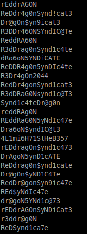
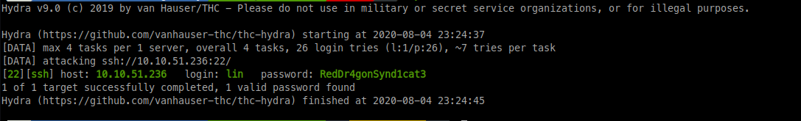
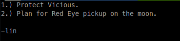
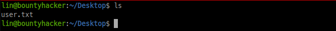
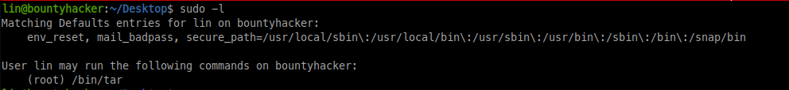
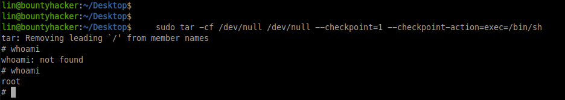

# Bounty-Hacker from [Tryhackme.com](https://tryhackme.com)

## Task 1: 

 No answer needed

## Task 2: 

 21,22,80 (No answer needed)

## Task 3:

We connect to FTP using anonymous login (Anonymous:Anonymous), and list the available files:
There is 2 files, task.txt and locks.txt. Once we done this, download the files doing: get FILE and in our machine we
can read it and we see that in task.txt the guy that write that message wrote up his name, lin

 

## Task 4: 

ssh

## Task 5: 

If we do a cat to locks.txt you can see that there are a lot of possible passwords, so let's try to bruteforce with hydra:
hydra -l lin -P locks.txt IP -t 4 ssh we would avaible to bruteforce the password, in this case is RedDr4gonSynd1cat3.

          

 

## Task 6: 

Once we have the password(RedDr4gonSynd1cat3) and the user(lin), we can log in with ssh and take the users.txt flag

 

## Task 7: 

When we are here, we have to do the basic steps of privesc, on this case we just make sudo -l and see that we can execute /bin/tar as root,
so we go to GTFO Bins search tar and we have the right command to privesc to root, in this case this is the command:
sudo tar -cf /dev/null /dev/null --checkpoint=1 --checkpoint-action=exec=/bin/sh, we do whoami, and we see we are root, and we have the root flag

 

 

Thanks for reading, Hope you enjoy it!!
